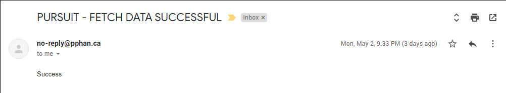

<div id="top"></div>

[![Contributors][contributors-shield]][contributors-url]
[![Forks][forks-shield]][forks-url]
[![Stargazers][stars-shield]][stars-url]
[![Issues][issues-shield]][issues-url]
[![MIT License][license-shield]][license-url]
[![LinkedIn][linkedin-shield]][linkedin-url]

<!-- PROJECT LOGO -->
<br />
<div align="center">
  <a href="https://github.com/pphan93/pursuit">
    
  </a>

<h3 align="center">Pursuit</h3>

  <p align="center">
    Start PURSUITING your dream jobs!
At Pursuit we made it an one stop shop for your jobs hunting. We offered many features that was made with job applicatons tracking in mind. Give Pursuit a try for free.
    <br />
    <a href="https://github.com/pphan93/pursuit"><strong>Explore the docs »</strong></a>
    <br />
    <br />
    <a href="#demo">View Demo</a>
    ·
    <a href="https://github.com/pphan93/pursuit/issues">Report Bug</a>
    ·
    <a href="https://github.com/pphan93/pursuit/issues">Request Feature</a>
  </p>
</div>

<!-- TABLE OF CONTENTS -->
<details>
  <summary>Table of Contents</summary>
  <ol>
    <li>
      <a href="#about-the-project">About The Project</a>
      <ul>
        <li><a href="#design-phase">Design Phase</a></li>
        <li><a href="#architecture-diagram">Architecture Diagram</a></li>
        <li><a href="#tech-stack">Tech Stack</a></li>
      </ul>
    </li>
    <li>
      <a href="#getting-started">Getting Started</a>
      <ul>
        <li><a href="#demo">Demo</a></li>
        <li><a href="#prerequisites">Prerequisites</a></li>
        <li><a href="#installation">Installation</a></li>
      </ul>
    </li>
    <li><a href="#usage">Usage</a></li>
    <li><a href="#roadmap">Roadmap</a></li>
    <li><a href="#contributing">Contributing</a></li>
    <li><a href="#license">License</a></li>
    <li><a href="#contact">Contact</a></li>
    <li><a href="#acknowledgments">Acknowledgments</a></li>
  </ol>
</details>

<!-- ABOUT THE PROJECT -->

## About The Project

[![Product Name Screen Shot][product-screenshot]](https://pursuit.pphan.ca)
Pursuit is an all-in-one job application tracking. Stop using excel sheets or note-taking applications to track your progress. Start using Pursuit to help you with your job search, it is super easy to use so you can stay organized, track every application, and land your dream job.

<p align="right">(<a href="#top">back to top</a>)</p>

### Design Phase

I used Figma to create my mockup design. I wanted something that is clean and modern. The final product have few minor changes compare to the mockup. This is due to technical issues or it doesn't look as good.

#### Landing Page


#### Home Page


#### Job Detail Page


### Architecture Diagram


#### Vercel

I used Next.js - reactjs framework to build the frontend and backend. Since Next.js is part of Vercel, it make sense to deploy the code to Vercel to host it. The deployment was very simple and straight forward to use. After creating an account, I started off by linking the github to Vercel then start deploying my project. The project will auto deploy if there any new git version to main branch (for production).

#### mongoDB Atlas

I decided to use mongodb as my database. The decision to make was based on that I wanted to learn more about it as I mostly used MS SQL in my professional jobs. The database is being host on mongoDB Atlas, which is free with some limitation. Throughout this project, I chose a hosting providers that are free to use and have some great benefit such as SSL and custom domain.

#### AWS

For salary estimation, I am using data from levels.fyi. Currently they dont have an API that is for the public. However, they do provide salary data in a json format for the data to be useable I have to tranform the data first. After the tranformation, the data get store into my mongodb database for the web application to use. You can find the script that I wrote in this repository called [levelsParseData](https://github.com/pphan93/levelsParseData). I has decided to use AWS Lambda to run my code. The product is free to use and it does the job well. It also have Event Bridge with is a serverless event bus that will trigger the code on different conditions. For this usecase, I want it to trigger on a schedule (every sunday). Lastly, after each run, I will recieve an status email to notify me if the job have been run successfully using SendGrid as email delivery.



### Tech Stack

- [Next.js](https://nextjs.org/) was used to build the UI, as well as the server-side logic (API) required for fetching and updating content from mongoDB. The reason for using this ReactJS frameworks:
  - API Routes
  - Built in react router
  - Hybrid statis & server rendering
  - Zero config
- [Vercel](https://vercel.com/) was used as a hosting platform for the application and it serverless functions. This is simple to use and it is free with many features.
- [React.js](https://reactjs.org/)
- [TailwindCSS](https://tailwindcss.com/) was used to build modern websites without having to touch css as much. This help speed up the building process and a learning process. This is my first time using TailwindCSS.
- [NextAuth.js](https://next-auth.js.org/) for authentication for Next.js
- [MongoDB](https://www.mongodb.com/) was used as a NoSQL database. It is currently being hosted on mongoDB Atlas.
- [AWS Lambda](https://aws.amazon.com/lambda/) for hosting the code to pull data from levels.fyi, parse the data, store the data into database, and then send email notification using Sendgrid.
- [AWS EventBridge](https://aws.amazon.com/eventbridge/) for triggering the lambda function every sunday.
- [SendGrid](https://sendgrid.com/) was used to send email notification when lambda function is finished running. It will if it fail to fetch data, parse the data, or writing to database.
- [CloudFlare](https://www.cloudflare.com/) uses as proxy between the users and server. This come with many benefits (free tier) such as CDN, DNS, DDOS, Ruleset.

<p align="right">(<a href="#top">back to top</a>)</p>

<!-- GETTING STARTED -->

## Getting Started

To get a local copy up and running follow these simple example steps.

### Demo

**See below for a quick demo. You can also try it out using this login.**
<a href="https://pursuit.pphan.ca">View Demo</a>

```
Username: johnd@email.com
Password: asdf1234
```

### Prerequisites

- [NodeJS](https://nodejs.dev/learn/how-to-install-nodejs) - Lastest version, please follow instruction from official document

- [npm](https://docs.npmjs.com/downloading-and-installing-node-js-and-npm)
  ```sh
  npm install npm@latest -g
  ```

### Installation

1. Install mongodb and configure it. You can use mongodb atlas if you dont want to install [MongoDB Atlas](https://docs.atlas.mongodb.com/getting-started/). Please go ahead and register it and then get connection detail for nodejs.
2. Clone the repo
   ```sh
   git clone https://github.com/pphan93/pursuit.git
   ```
3. Install NPM packages
   ```sh
   npm install
   ```
4. Enter your API in `env.local` - create the file if you haven't already in the root folder of the project

   ```js
   SECRET=xxxx

   AUTH0_CLIENT_ID=xxxx
   AUTH0_CLIENT_SECRET=xxx
   AUTH0_ISSUER=https://dev-xxxxx.us.auth0.com

   LINKEDIN_CLIENT_ID=xxxxx
   LINKEDIN_CLIENT_SECRET=xxxxx

   MONGO_USER=user
   MONGO_PASS=password
   MONGO_CLUSTER=cluster0.xxxx.mongodb.net
   MONGO_DB=pursuit
   ```

<p align="right">(<a href="#top">back to top</a>)</p>

<!-- USAGE EXAMPLES -->

## Usage

Use this space to show useful examples of how a project can be used. Additional screenshots, code examples and demos work well in this space. You may also link to more resources.

_For more examples, please refer to the [Documentation](https://example.com)_

<p align="right">(<a href="#top">back to top</a>)</p>

<!-- ROADMAP -->

## Roadmap

- [ ] Metrics - Show cards (total, rejected, etc) and graphs on job applications.
- [ ] Tasks/Note - Allow users create tasks or notes
- [ ] Work with other site such as Glassdoor, Linkined, and other to gather information (company rating, salary estimations, company infomation). Currently trying to get Glassdoor api access.

See the [open issues](https://github.com/pphan93/pursuit/issues) for a full list of proposed features (and known issues).

<p align="right">(<a href="#top">back to top</a>)</p>

<!-- CONTRIBUTING -->

## Contributing

Contributions are what make the open source community such an amazing place to learn, inspire, and create. Any contributions you make are **greatly appreciated**.

If you have a suggestion that would make this better, please fork the repo and create a pull request. You can also simply open an issue with the tag "enhancement".
Don't forget to give the project a star! Thanks again!

1. Fork the Project
2. Create your Feature Branch (`git checkout -b feature/AmazingFeature`)
3. Commit your Changes (`git commit -m 'Add some AmazingFeature'`)
4. Push to the Branch (`git push origin feature/AmazingFeature`)
5. Open a Pull Request

<p align="right">(<a href="#top">back to top</a>)</p>

<!-- LICENSE -->

## License

Distributed under the MIT License. See `LICENSE.txt` for more information.

<p align="right">(<a href="#top">back to top</a>)</p>

<!-- CONTACT -->

## Contact

Phuoc Phan

Project Link: [https://github.com/pphan93/pursuit](https://github.com/pphan93/pursuit)

<p align="right">(<a href="#top">back to top</a>)</p>

<!-- ACKNOWLEDGMENTS -->

<!-- ## Acknowledgments

- []()
- []()
- []() -->

<!-- <p align="right">(<a href="#top">back to top</a>)</p> -->

<!-- MARKDOWN LINKS & IMAGES -->
<!-- https://www.markdownguide.org/basic-syntax/#reference-style-links -->

[contributors-shield]: https://img.shields.io/github/contributors/pphan93/pursuit.svg?style=for-the-badge
[contributors-url]: https://github.com/pphan93/pursuit/contributors
[forks-shield]: https://img.shields.io/github/forks/pphan93/pursuit.svg?style=for-the-badge
[forks-url]: https://github.com/pphan93/pursuit/network/members
[stars-shield]: https://img.shields.io/github/stars/pphan93/pursuit.svg?style=for-the-badge
[stars-url]: https://github.com/pphan93/pursuit/stargazers
[issues-shield]: https://img.shields.io/github/issues/pphan93/pursuit.svg?style=for-the-badge
[issues-url]: https://github.com/pphan93/pursuit/issues
[license-shield]: https://img.shields.io/github/license/pphan93/pursuit.svg?style=for-the-badge
[license-url]: https://github.com/pphan93/pursuit/blob/master/LICENSE.txt
[linkedin-shield]: https://img.shields.io/badge/-LinkedIn-black.svg?style=for-the-badge&logo=linkedin&colorB=555
[linkedin-url]: https://www.linkedin.com/in/phuoc-phan/
[product-screenshot]: public/Pursuit_pic.png
[product-diagram]: readme/Pursuit_Diagram.png
